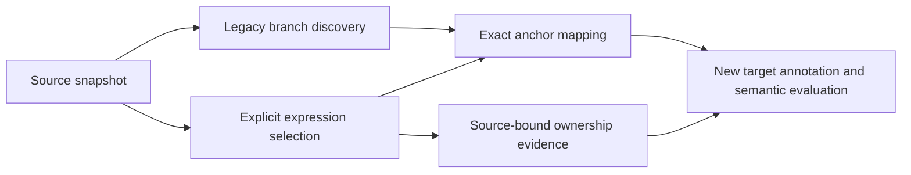

# Explicit decision targets (experimental v1)

## Why introduce another artifact?

The legacy metric discovers control-flow constructs. A semantic evaluation may
instead select a whole function, an expression passed to `require`, or a
Specification declaration. These are different units. Comparing their labels
as if they were identical does not measure the production classifier's quality.

An **analysis target** is one explicitly selected syntax expression, bound to
exact source bytes. Its enclosing declaration is supporting context, not the
thing being classified. An expression may still contain multiple domain rules;
this contract does not claim to discover an indivisible intent atom or domain
decision automatically. A whole `FirstMatch` construction is an assembly/control
target and must be identified as such in an evaluation design.

The Rust `extract-decision-target` command implements this contract for Python.
It is an offline extraction tool. It does not discover additional opportunities,
call a model, infer eligibility/concern-kind, prove Specification identity,
change registry fingerprints, or change S/U. Existing `classify` and its request
schema remain v1 scanner-candidate consumers; they do not consume this artifact.

## Selection contract

Input identifies a relative `.py` path, a positive 1-based line and UTF-8 **byte**
column, the exact tree-sitter syntax kind starting there, and one selector:

| Selector | Supported anchor | Selected expression |
|---|---|---|
| `condition` | `if_statement`, `elif_clause`, `while_statement` | `condition` field |
| `condition` | `conditional_expression` | middle named child (ternary test) |
| `value` | `return_statement` | returned expression |
| `value` | `assignment` | right-hand value |
| `value` | `lambda` | lambda body |
| `expression` | call, boolean/comparison/unary operator, identifier, attribute, subscript, ternary | same expression |

When multiple nodes of the same kind start at the exact same position, the
outermost matching node is selected. This matters for `a and b and c`; the full
chain is one explicit target rather than an arbitrary inner subchain. The
output's exact span is authoritative. Selecting an entire function/block as an
expression is rejected. Unsupported syntax, a missing value, wrong anchor,
invalid UTF-8, parser errors anywhere in the file or a target over 4 KiB fail
explicitly and produce no target JSON. There is no nearest-node fallback.

Source paths must be normalized and relative to the supplied root. Absolute
paths, `..`, alternate separators and symlinks escaping that root are rejected.
An optional `--expected-source-digest blake3:<hex>` refuses changed files.
All extraction and context use the same in-memory source snapshot.

```bash
specification-metrics extract-decision-target ./project \
  --path tools/gate.py --line 28 --column 5 \
  --syntax-kind if_statement --select condition
```

## Artifact and identity

The JSON artifact has `artifact_type=specification_metrics.decision_target`,
`schema_version=1`, `experimental=true` and `language=python`.

- `path` and `source_digest` identify the actual full source bytes; no Git
  revision is guessed from a possibly dirty checkout.
- `anchor`, `expression` and `context` include syntax kind, complete-source span,
  BLAKE3 of the complete slice, code and an explicit truncation flag.
- Spans use 0-based UTF-8 byte offsets and 1-based lines/byte columns. All end
  offsets and end positions are exclusive.
- The target expression is exact and never truncated. Anchor code is capped at
  4 KiB and context at 12 KiB on UTF-8 boundaries. Their spans/digests continue
  to identify the complete slice even when their code is truncated.
- Context is the nearest enclosing assignment/function/class, including the
  anchor itself when applicable; otherwise it is the anchor. This is not an
  inferred dependency closure or a guarantee of sufficient semantic context.
- `target_id` is BLAKE3 of the compact JSON tuple `(contract-v1 ID, path,
  source_digest, expression syntax kind, start_byte, end_byte)`. Different valid
  selectors resolving to the same expression produce the same ID. Any change
  to the full file creates a new snapshot identity, including unrelated changes.
  This is **not** a persistent rule address across revisions.
- `ownership_status=unknown` and `metric_effect=none` are explicit. A factory
  spelling is not an imported library identity proof.

The total artifact size is not a hosted-provider budget: repeated anchor/context
strings and escaping add bytes. A future provider adapter must build and cap its
own request, record all truncation and preserve a digest of that exact request.

## Relationship to discovery, ownership and classification



An equal anchor position links a legacy candidate to a target, but does not make
their excerpts or semantic labels equal. Keep the legacy fingerprint separately.
No match means the old scanner has no candidate at that anchor; it does not mean
`excluded`, zero policy, or a discovery failure against an unchanged contract.

Ownership evidence must bind the target to a verified declaration/construction
and the same source snapshot, with its own assumptions and provenance. The
bounded Python construction evidence in the evaluation suite is independent of
this Rust exporter. Unknown ownership must never silently become an exclusion.

Targets remain separate occurrences even if their expressions look alike.
Duplicate-rule grouping, helper/caller aliasing, logical ownership and temporal
identity require additional evidence; syntax equality alone does not collapse
the denominator or establish reuse. Keep occurrence identity, rule-family
identity and runtime/spec address as separate concepts.

## Evaluation transition and acceptance

1. Freeze explicit selectors, source revisions/digests and extraction version.
2. Export exact expression targets and retain all planned cases, including
   extraction failures in an incomplete-run receipt if a runner supports one.
   The current bounded runner fails closed instead of emitting partial success.
3. Inspect the target boundary and missing context. A helper call may require
   the helper definition; the nearest declaration alone does not reveal it.
4. Re-annotate the new targets. Never transfer whole-function reference labels
   or recorded model answers to their newly selected predicates automatically.
5. Compare reference and model on identical target/context/profile/rubric bytes.
   Score each semantic axis and ownership separately; retain unknowns and
   operational failures. Only then design a new-family confirmation study.

Current acceptance is structural: exact bytes, deterministic snapshot identity,
safe path handling, freshness checks, explicit unsupported cases, no ownership
inference and no metric writes. It does not establish semantic accuracy.

See the [historical eight-case alignment](../evals/jev-classification/runs/2026-10-10-decision-targets/README.md).
Swift/Rust target extraction and automatic decision discovery are deferred.
